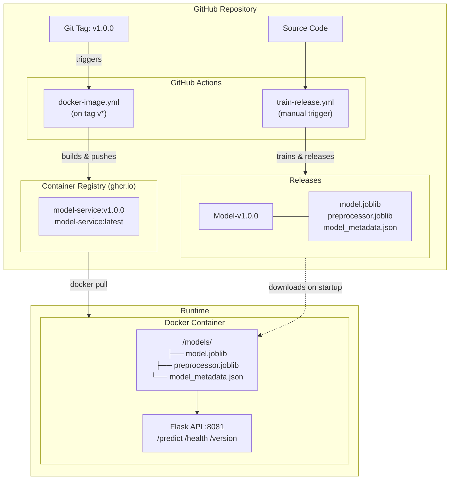

# SMS Checker Model Service

Backend ML service for SMS spam detection. Part of the DODA A1 assignment.

## Quick Start

```bash
docker build -t model-service .
docker run -d -p 8081:8081 model-service
```

The server will start on port 8081. Access the API docs at [localhost:8081/apidocs](http://localhost:8081/apidocs).

### Example Request

```bash
curl -X POST "http://localhost:8081/predict" \
  -H "Content-Type: application/json" \
  -d '{"sms": "Congratulations! You have won a free prize!"}'
```

Response:
```json
{
  "classifier": "decision tree",
  "result": "spam",
  "sms": "Congratulations! You have won a free prize!",
  "service_version": "v1.0.0",
  "model_version": "Model-v1.0.0"
}
```

## API Endpoints

| Endpoint | Method | Description |
|----------|--------|-------------|
| `/predict` | POST | Classify an SMS as spam or ham |
| `/health` | GET | Health check with version information |
| `/version` | GET | Detailed version information |
| `/apidocs` | GET | Swagger API documentation |

## Versioning Strategy

This repository uses **two separate versioning tracks** for different artifacts:

### 1. Container Releases (`v{major}.{minor}.{patch}`)

Follows the [semantic versioning](https://semver.org/) convention.

### 2. Model Releases (`Model-v{major}.{minor}.{patch}`)

**What**: Trained ML model artifacts (`.joblib` files)  
**Where**: GitHub Releases (attached assets)  
**Release Trigger**: Manual workflow dispatch

Developers should manually decide when to re-traing of a model is neccesary and
follow these rules:

**Compatibility-Based Semantic Versioning:**
- **MAJOR**: Format/serialization changes (breaks model loading)
- **MINOR**: Input/output schema changes (breaks inference pipeline)
- **PATCH**: Retraining with same pipeline (performance improvements only)

**Release Assets:**
- `model.joblib` - Trained classifier model
- `preprocessor.joblib` - Text preprocessing pipeline
- `model_metadata.json` - Training metadata and compatibility info

### Compatibility Matrix

The container validates model compatibility at startup using `model_metadata.json`:

```json
{
  "compatibility": {
    "min_service_version": "v1.0.0",
    "format": "joblib",
    "input_schema": "text_string",
    "output_schema": "ham_or_spam"
  }
}
```

Check compatibility via the `/health` endpoint:

```bash
curl http://localhost:8081/health
```

## Configuration

### Environment Variables

| Variable | Default | Description |
|----------|---------|-------------|
| `MODEL_SERVICE_PORT` | `8081` | Port the service listens on |
| `MODEL_PATH` | `/models/model.joblib` | Path to model file |
| `PREPROCESSOR_PATH` | `/models/preprocessor.joblib` | Path to preprocessor file |
| `METADATA_PATH` | `/models/model_metadata.json` | Path to metadata file |
| `DEFAULT_MODEL_URL` | GitHub latest | URL to download model if missing |
| `DEFAULT_PREPROCESSOR_URL` | GitHub latest | URL to download preprocessor if missing |
| `SERVICE_VERSION` | `v1.0.0` | Reported service version |

### Using a Specific Model Version

By default, the container downloads the latest model. To pin a specific version:

```bash
# Option 1: Mount local model files
docker run -d -p 8081:8081 \
  -v /path/to/models:/models \
  model-service

# Option 2: Override download URLs
docker run -d -p 8081:8081 \
  -e DEFAULT_MODEL_URL="https://github.com/doda25-team2/model-service/releases/download/Model-v1.2.3/model.joblib" \
  -e DEFAULT_PREPROCESSOR_URL="https://github.com/doda25-team2/model-service/releases/download/Model-v1.2.3/preprocessor.joblib" \
  model-service
```

## Development

### Training the Model Locally

```bash
# Install dependencies
curl -LsSf https://astral.sh/uv/install.sh | sh
uv sync

# Download dataset
uv run python src/get_data.py

# Preprocess data
uv run python src/text_preprocessing.py

# Train model
uv run python src/text_classification.py
```

### Running Locally (Development)

```bash
uv run python src/serve_model.py
```

### Creating a Model Release

1. Go to **Actions** → **Train & Release Model**
2. Click **Run workflow**
3. Select version bump type:
   - `patch` - Retraining with same pipeline
   - `minor` - Changed preprocessing/features
   - `major` - Changed model format/serialization
4. Optionally add release notes
5. Click **Run workflow**

### Creating a Container Release

1. Create and push a Git tag:
   ```bash
   git tag v1.2.3
   git push origin v1.2.3
   ```
2. The **Release Docker image** workflow will automatically build and push to GHCR

## Architecture



